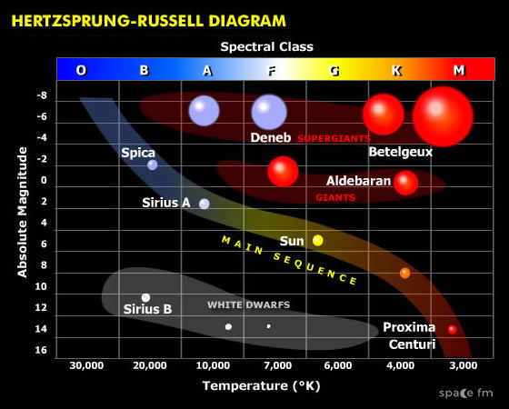
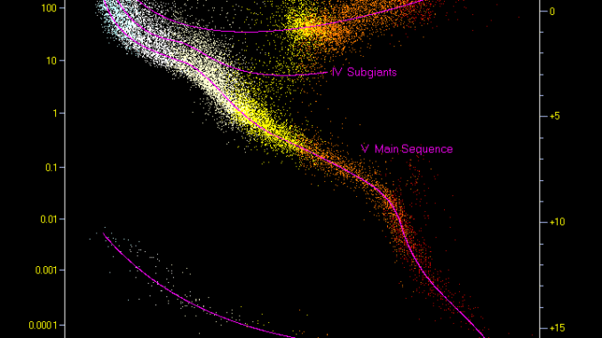
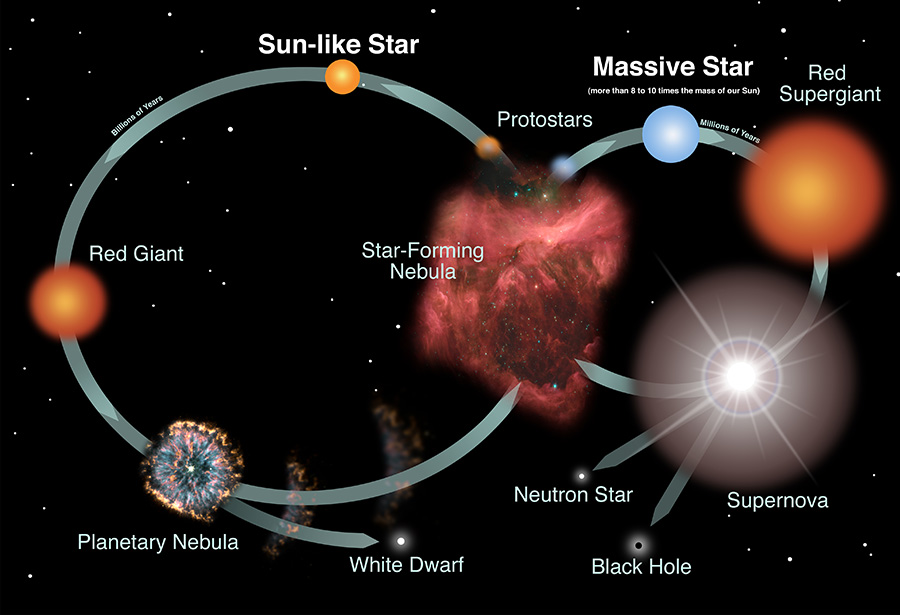
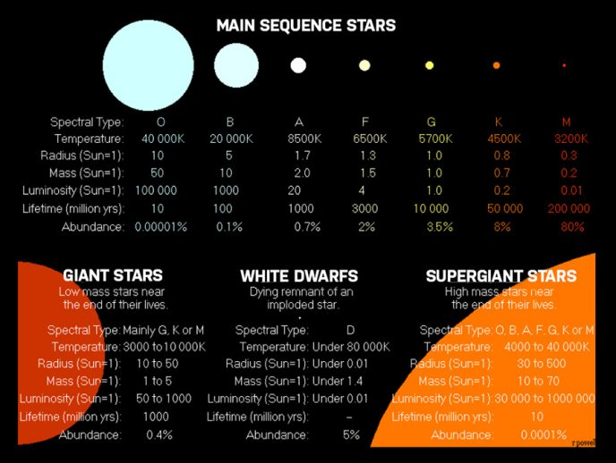

# Things to Remember For Game

- Small Yellow, Orange, and red stars are better for life
- most stars have a buddy or two 
- The biggest stars become super giants in dense nebulae
- Most stars end as white dwarfs

# Star types

https://astrobackyard.com/types-of-stars/

Most comprehensive
https://www.astronomytrek.com/list-of-different-star-types/

Sorted most developed to Least (roughly)
- Black Holes
- Neutron Stars (0.7%)
- White Dwarfs (4%)
- Red Supergiants
- Red Giants
- Blue Supergiants
- Blue Giants
- Blue Stars (0.00003%)
- Yellow Dwarfs (10%)
- Orange Dwarfs (10%)
- Red Dwarf Star (73%)
- Brown Dwarf (1-10%)
- T Tauri Star
- Protostar

# Habitability
In General stars with a lower temperature and energy put off less harmful radiation. These include
- G-Dwarfs
- K-Dwarfs
- ~ M-Dwarfs 

### Orange Dwarves
Orange dwarves are good for life
- are between red and yellow stars
- less UV radiation then yellow stars
- 30 billion year life (vs 10 for our sun)
- 4x as common as yellow stars

https://astrobackyard.com/types-of-stars/

### Orange Dwarves
Orange dwarves are good for life
- are between red and yellow stars
- less UV radiation then yellow stars
- 30 billion year life (vs 10 for our sun)
- 4x as common as yellow stars

### Red Dwarves
Probably bad for life
- planets in zone are tidally locked
- one side frozen (liquids and gases), other side dry and hot
- frequent solar flares (doubling brightness in minutes)

Some guess that a thick atmosphere or planetary ocean could combat some of the problems.
https://en.wikipedia.org/wiki/Red_dwarf#Habitability

They get flares from strong magnetic fields. (m dwarfs have good convection, and also rotate slowly allowing magnetic fields to buildup) - llama

# Binary Stars
Around half the stars in the galaxy are in a group of at least two stars

### X-Ray Binary Star
one of the stars is a collapsed object such as a white dwarf, neutron star, or black hole. As matter is stripped from the normal star, it falls into the collapsed star, producing X-rays.

# SuperGiants
Super giants often form in regions where there is a lot of material present. They form after O and B stars reach the end of the main sequence (when they run out of hydrogen)
Lifecycle:
- run out of hydrogen, switch over to burning helium. 
- If they're on the small side they puff off a nebula burning the hydrogen and helium shell. 
- Otherswise they continue to burn heavier elements in their cores until they collapse (when they run out of fuel and gravity can squish everything down). 
- they then become a nuetron star or black hole after they supernova (they're too big to become a white dwarf)

Stars more massive than about 40 M☉ cannot expand into a red supergiant. Because they burn too quickly and lose their outer layers too quickly, they reach the blue supergiant stage, or perhaps yellow hypergiant, before returning to become hotter stars.

It seems like blue super giants and red super giants mostly differ in mass? (With red having more mass)

The most massive stars, above about 100 M☉, hardly move at all from their position as O main-sequence stars. These convect so efficiently that they mix hydrogen from the surface right down to the core. They continue to fuse hydrogen until it is almost entirely depleted throughout the star, then rapidly evolve through a series of stages of similarly hot and luminous stars: supergiants, slash stars, WNh-, WN-, and possibly WC- or WO-type stars.

https://en.wikipedia.org/wiki/Supergiant#Evolutionary_supergiants