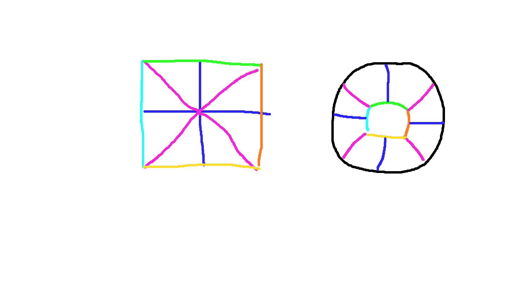

 

# Space Coordinates

The max seed is -9223372036854775808 to 9223372036854775807 given by std::numeric_limits(int64_t)().max() (and min) on my PC. (int64_t is meant to be the same on all machines) This would become a little less with our math constraints down below (dividing evenly)

### quadrant
Each seed value is a unique quadrant in space (cube)

If each of these represents a quadrant then (9223372036854775807 + 9223372036854775808)^(1/3) = 2,642,245.94962913 size square cube of quadrants can be derived.

The observable universe is 27.6 billion light years across. (27,600,000,000 / 2,642,245) So one quadrant would have to be 10,445.66 light years across. We'll just say 10,000 light years

### Number of Stars
Stellar density is estimated as (1 star per 250 cubic light years) near our sun
https://en.wikipedia.org/wiki/Stellar_density
https://en.wikipedia.org/wiki/Milky_Way 

The Milky way is 100,000 - 120,000 light years across
The volumne is about 9,503,317,777,109 cubic light years with a thickness of 1,000 light years


Andromeda is 2.537 million light years away from the Milky Way. Distances between galaxies varies from 100,000 - 10,000,000,000 light years. We'll use 200 million as an average


100 billion to 400 billion stars in the milky way


So in the quadrant we'll calculate which cubic light years will have solar systems and planets. If a quadrant is part of a galaxy, then it should have a ~1,000 light year slice of stars. (if the galaxy is a disk galaxy). This slice should have somewhere between 0 - 126,271,690,466 stars with an average amount of 21,045,281,744 stars. 

A cubic light year should have 0-1000 stars with an average of ~0.004 stars inside a galaxy.


### World Position
Then we'll add the light year coordinates to the seed (quadrant) when creating the world.

Though worlds can be less than a light year apart so we need to use light-minutes to represent the world position as well 

There are 9,460,730,472,581 km in one light year

So a location in space is defined as follows:

(quadrant x):(quadrant y):(quadrant z) :: (light year x):(light year y):(light year z) :: (km x):(km y):(km z)

With ranges:
- quadrants -3,490,729,320,012 to 3,490,729,320,012
- light year 0 to 10,000
- km 0 to 9,460,730,472,581

Here's an example space location
2348:292938:-235233 :: 800:1523:8203 :: 14050:234567903:14

### Seed -> quadrant
quadrant coordinates can be calculated from a seed with this equation (Note maxSeed - minSeed needs to be odd, so subtract 1 if need be)
- span = (maxSeed - minSeed)^(1/3)
- half = floor(span / 2)
- max = half - 1
- min = -half

Which for our square cube 2,642,245 quadrants would be
- span = 2,642,245
- half = 1,321,122
- max = 1,321,122
- min = -1,321,122
- midSub = span * half + half
- if seed > 0
    - y = floor( (seed + midSub) / span^2 )
    - adj = (seed > midSub)? (seed - midSub - 1) % span^2 : seed + half
    - x = (adj % span) - half
    - zSub = (seed > midSub)? half : 0
    - z = floor(adj / span) - zSub
- else
    - y = floor( (seed - midSub) / span^2 )
    - adj = (seed < -midSub)? (seed + midSub + 1) % span^2 : seed - half
    - x = (adj % span) + half
    - zSub = (seed < -midSub)? half : 0
    - z = floor(adj / span) + zSub


To get the seed from the coordinates use the following equation:
- midSub = span * half + half
- if y > 0
    - x + half + (z + half) * span + (y - 1) * span^2 + midSub + 1
- elif y == 0
    - x + z * span
- else
    - x - half + (z - half) * -span + (y + 1) * span^2 - midSub - 1


This means the center quadrant (0:0:0) would be seed: 
- 0 + 0 * 2,642,245 = 0

Makes Sense!


The max cooridinates (1,321,122:1,321,122:1,321,122) and (-1,321,122:-1,321,122:-1,321,122) would be seeds:
- midSub = 2,642,245 * 1,321,122 + 1,321,122 = 3,490,729,320,012

- 1,321,122 + 1,321,122 + (1,321,122 + 1,321,122) * 2,642,245 + (1,321,122 - 1) * 2,642,245^2 + midSub + 1 = 2,642,244 + 6,981,453,355,536 + 9,223,351,619,968,468,025 + 3,490,729,320,012 + 1 
= 9,223,362,092,153,785,818

- -1,321,122 - 1,321,122 + (-1,321,122 - 1,321,122) * 2,642,245 + (-1,321,122 + 1) * 2,642,245^2 - midSub - 1 = -2,642,244 - 6,981,453,355,536 - 9,223,351,619,968,468,025 - 3,490,729,320,012 - 1
= -9,223,362,092,153,785,818

So these are a little less than our max number of seeds (because of int64_t overflow)


### Planet Duplication
This does mean that there can be duplicate planets given there are only 18,446,724,184,307,571,637 possible seeds into the random function
We also don't allow seeds between -20,000 and 20,000 so subtract 40,000 from that.

So we can represent (2,642,245 * 10,000)^3 cubic light years of space. With galaxies occuring on average every ~200 million light years

That'd be (2,642,245 * 10,000 / 200,000,000)^3 = ~2,305,840 galaxies

Each of these could have ~200 billion stars

So that'd be 461,168,000,000,000,000 stars. If they all have ~6 planets and ~20 moons
then that'd be 

11,990,368,000,000,000,000 worlds 

We have 18,446,744,073,709,551,616 possible seeds so
11,990,368,000,000,000,000 / 18,446,744,073,709,551,616 = 0.6499 duplicate worlds

So basically there is a chance for a copy of each world somewhere in the 'universe' (however their neighbors would be different since the world seed is the quadrantSeed + worldLocation)


The center of the universe is quadrant (0:0:0) 

We could also measure the offset from the center of the universe with this conversion
- x = (quadrant x) * 10,000 + light year x
- y = (quadrant y) * 10,000 + light year y
- z = (quadrant z) * 10,000 + light year z

However this would overflow a int64_t value so we'd have to use a library to use a BigInt that could be greater.
Either way, we'd only want to use that number to display to the user. They might prefer the quandrant, light year, kilometer presentation anyway.


Inside a light year we'll want to divide up the space to determine the position of the player as well as the position of solar
systems and the moving planets within those. We'll divide up light-years into light-minutes


# PLANET TERRAIN

https://nssdc.gsfc.nasa.gov/planetary/factsheet/

In the game engine we'll load each of these chunks as 1/4 size. So a '1 chunk' block will actually 
be 25 cm in the game engine. 

For the player (game size not game engine size ) a '1 chunk' block is 50 cm or half a meter. 
So 4 blocks will be the height of the player.


For each of the following sizes do: elevation, erosion/climate/vegetation, textures.
- 2,097,152 chunks
- 131,072 chunks
- 8192 chunks
- 512 chunks
- 64 chunks
- 16 chunks
- 4 chunks
- 1 chunks

Since each block is a half meter and coordinates are int64_t types, the max world size is 9,223,372,036,854,775,807 0.5m blocks,
or 4,611,686,018,427,387,904 m


## space gen -> terrain gen

| **Planet**  | **Equatorial Diameter** | **Approx. Equatorial Circumference** |
| ----------- | ----------------------- | ------------------------------------ | 
| **Mercury** | ~4,880 km               | ~15,330 km                           | 
| **Venus**   | ~12,104 km              | ~38,030 km                           | 
| **Earth**   | ~12,756 km              | ~40,075 km                           | 
| **Mars**    | ~6,792 km               | ~21,340 km                           | 
| **Jupiter** | ~142,984 km             | ~449,600 km                          | 
| **Saturn**  | ~120,536 km             | ~379,000 km                          | 
| **Uranus**  | ~51,118 km              | ~160,600 km                          | 
| **Neptune** | ~49,528 km              | ~155,600 km                          | 
| **Sun**     | ~1,392,700 km           | ~4,370,000 km                        | 
| **Stephenson 2-18 (DFK 1)** | ~1,497,000,000 km | ~9,400,000,000 km          | 
| **Phobos (moon)** | ~22 km            | ~69 km                               | 
| **Kepler-277c** | ~42,820 km          | ~134,500 km                          | 
| **The Moon** | ~3,474 km.             | ~10,908 km                          | 

which is 4,611,686,018,427,387 km. So we could even represent the surface of Stephenson 2-18 the largest known star. However 805,306,368m is the biggest circumfirence we can represent with chunk_2097152's which would render ~500k blocks if rendered all at once. So pretty much anything that isn't a star will be representable that way. We'll just have to make stars spheres of differing brightness. However, brown dwarfs would look like jupiter maybe with swirls and such.

Normal stars behave like a fluid more a less in their center so we wouldn't have terrain there. However White Dwarfs and nuetron stars would
have solid surfaces, however they'd typically be earth sized. But they have such intense gravity that they'd be nearly perfectly smooth.

A rocky planet with ~5× Earth’s surface gravity would likely have:
- Radius: ~2.0–2.3 × Earth
- Diameter: ~25,500–29,300 km
- Circumference: ~80,000–92,000 km
- max mountain height of ~1 km

A rocky planet with ~10× Earth’s surface gravity would likely have:
- Radius: ~2.7–3.0 × Earth
- Diameter: ~34,000–38,000 km
- Circumference: ~107,000–120,000 km
- max mountain height of ~300–500 m

So once you hit a circumfurence of around 100,000 km you pretty much have a flat world. Kepler-277c (biggest known rocky planet) has a radius of 3.36 x Earth so it would be pretty smooth probably. Around 20–50 Earth masses and solid planet starts to turn liquid (or playdough like) which is 5x-10x earth gravity. So Kepler-277c is probably like
that.

So 80,000 km circumference is probably the largest that would have any significant terrain to show in space. That'd be 80,000,000x2 0.5m blocks, or 76x76 chunk_2097152's. In chunk_131072 that'd be 1220x1220 or 1,488,400 blocks to spawn in. You can notice curvature on the surface of a moon less than ~50km radius or ~300km circumference. For asteriods or moons less than 300km in circumferance we'll do asteriod gen and spawn blocks in space.


For larger celestial objects, we'll have an adpative terrain gen as you near the planet, and once you're like 500m above the surface we'll switch to terrain gen. 

We'll map our flat world to a sphere by matching up all sides on the back of the planet. When approaching a planet we'll have the player facing the less ugly side by default.



## planet size in space
Godot looses floating point precision at around 10,000-20,000 units, or 40,000-80,000 meters in game distances.

We may consider eneabling 64bit (instead 32bit) float precision to have larger coordinates. This can be done but requires recompiling the engine https://docs.godotengine.org/en/stable/tutorials/physics/large_world_coordinates.html

We want to be able to represent our largest planet in a scale that still looks good. We'll also want the player to be able to fly around the planet somewhat so I think the max size of the planet in godot would be like 4,000m in diamter.

If we shrink the player by a factor of 100x then we'll need at least ~0.0001 units of precision which we'll have at a around 10,000 godot units. So that would make the 4,000m planet like 400,000m in diameter relative to the player. Stephenson 2-18 (DFK 1) has a diameter of ~1,497,000,000 km so we'd be shrinking that a lot if we made it 4,000,000m. With that scale earth would only be 3.4m in diameter in godot. 

I think we'll want to do something adpative in making the planet larger as you get closer. The math for determing the size via the distance follows this math:

```
angular_size = 2 arctan(radius_of_planet / distance_to_planet)
```

So we'll initially set the scale of the space region to be very large and the planet really small. The largest start Stephenson is pretty large. We could say that every godot meter is 1,000,000,000m making Stephonson 1,497m in the engine. This would make earth 0.0128 meters in the engine and jupiter would be 0.14m. At this point we'll just show single color spheres. 

Once you get within 1,000,000,000m or 1 godot m, we'll transition to a visuals where one godot meter is 1,000,000m in game. We'll determine the point cloest on the surface of the planet it to you and position it at the origin, and position the player at -10,000. At this point jupiter would be 143m in diameter(and earth would be 12.7m) so we'll start doing space gen at this point instead of single color spheres.

Once you get within 1,000,000 m we'll transition to 1,000m in game to 1 godot meter. (with the planet position at the origin. At this point or maybe before, very large objects won't be spheres but just a round surface will be rendered in). Here jupiter would be 142,984m in diameter and earth would be 12,756m in diameter. This is also done with space gen, and will transition to terrain gen once within 1000m of the surface (or 1.0 godot meters)

Each time we switch zones the player position and rotation will be calulated and they'll be placed in the correct relative position

Levels
| Distance             |   Mode                                 | Scale                       | Jupiter Size    | Earth Size     |
|----------------------|----------------------------------------|-----------------------------|-----------------|----------------|
| >1,000,000,000m      | plain spheres                          | 1 godot m -> 1 light year   |                 |                |
| <1,000,000,000m      | space gen on concave surface or sphere | 1 godot m -> 1,000,000m     | 142 godot m     | 12 godot m     |
| <1,000,000m          | space gen on concave surface or sphere | 1 godot m -> 1,000m         | 142,984 godot m | 12,756 godot m |
| <1,000m              | terrain gen                            | 1 godot m -> 4m             |                 |                |


For multiplayer or other npc ships, we'll only want to render them in in space gen when they're really close to the player so we don't destroy the perspective illusion. For the 1 godot m -> 1,000m level, we could probably load in any other ship since the planet will be pretty massive in view. But with the level above that we may not want to load in anybody. Or if we do we'll have to scale them to the correct to maintain the illusion.

For sky gen the biggest objects in the sky will be stars, but really planets from their moons, as we won't need to genereate the surface of stars probably. But planets viewed from their moon could take up like 40-70 degrees in the sky limited by tidal forces ripping the moon up if it was too close limited by this equation
```
Roche limit ≈ 2.5 × R_planet × (ρ_planet/ρ_moon)^(1/3)
```
So a super large rocky planet (like 3 earth radii) with a tiny icy moon could be the largest in the sky. Asteriods can orbit even closer and the planet could take up the whole sky.

To find the max size for skyboxs we'll want to calculate the the degrees of the max planet size at 1,000,000,000m using this equation:
```
degrees = 2 × arctan(radius / distance)
```
The biggest planets are about 2 x jupiter's radius. So that plaent at 1,000,000,000m would be ~17 degrees in the sky or about 10% of the sky. So for skygen we can just use 2097152 chunks for determine pixels on the planet.


## space ship speed
The solar system is roughly 100 AU or 14,960,000,000,000m. To cross that in like 5 minutes you'd be 
going like 14,960,000,000,000/(5*60) = 49,866,666,666 m/s. The speed of light is 299,792,458 m/s so that's not feasable. You'll have to teleport throught the spirit medium instead.

Things get weird as you get to light speed scale taking more energy as you get faster

```
E = (y-1)mc^2
y = 1 / sqrt(1-v^2/c^2)

where E is joules, v is velocity in the speed of light, and m is kg

The basic function can be graphed like this:
1/sqrt(1-x^2) - 1
```

(y - 1) * 100 above give you the time dilation percent you'd experience. So at 0.3c you'd get
```
(1/sqrt(1-0.3^2) - 1) * 100 = 4.8%
```
So at 0.3c, 60 seconds on the ship is 62.88 seconds for someone at rest. So we won't need to worry about time descrepancies if we let players travel at that speed. But this speed is also like 10x the energy of 0.1c so it takes a lot to get up to this speed and you also need sheilding as dust is dangerous at this speed.

Here's what chat gpt said the visual effects would be from traveling at 0.3c:
- The sky ahead: slightly brighter, slightly bluer stars
- The sky behind: slightly dimmer, redder stars
- Abberation of Light: compressed forward (whole skybox kind of get condesned in front of us)
- Overall: a mild tunnel effect, not the extreme “Stargate” look from sci-fi movies

However the abberation of light would be pretty slight, with it only looking slightly more compressed. https://youtu.be/vFNgd3pitAI?t=238

The blue shifting would be more noticable than the abberation

At 0.5c you'd get
```
(1/sqrt(1-0.5^2) - 1) * 100 = 15.5%
```
Or 60 seconds on the ships would be 69.3 seconds in real life. Dust would also be really dangerous at this speed. So maybe we'll have to like slow down physics on the ship to represent the time dialation.  

But at 0.5c (149,896,229 m/s) it's take 14,960,000,000,000/149,896,229 = 99,802s to cross the solar system or 27 hours. To get to alpha centauri it take 4.24/0.3 = 14.1 years in game. To get to the moon at that speed it'd take 384,400,000m / 149,896,229 = 2.5s. Other planets are similarly distanced from their moons, typically 10,000km - 2,000,000km or like 0.0s-13s at 0.3c. To get to mars it'd take 200,000,000,000m / 149,896,229 = 1334s or 22 mins at an average mars distance (when mars is at it's nearest it would be more like 4mins). Jupiter at it's nearest would be 588,000,000,000m / 149,896,229 = 3,923s or 65 mins. So determined players could do that as well.

So going to a moon would be viable in game in a space ship and another planet would be viable for some players. Most will probably want to use the spirit medium to travel. At 0.3c only moon travel would be really good, though you could still go to mars in about 7mins at optimal times.

However at speeds of 0.1c a tiny dust particle can basically do the same damage as a bullet. Really 0.05c is the limit with just a thick steel hull. You'd typically hit 2-3 dust particles per second with a 10m diamter cross section. At 0.05c it'd take 384,400,000/(299,792,458*0.05) = 25.6s to reach the moon. Probably more like a minute with speed up and slow down times.


From claude, if you hit the atmosphere of a planet at 0.5c would instantly vaporize the ship and create a huge explosion. 

| Speed    | Explosion           |
|----------|---------------------|
| 0.05c    | 500 Tsar Bombas     |
| 0.1c     | 2,000 Tsar Bombas   |
| 0.3c     | 50,000 Tsar Bombas  |
| 0.5c     | 130,000 Tsar Bombas |

At 0.3c it'd be similar to the Chicxulub asteriod that killed the dinosaurs.

Effects at 0.3c
- burn everything for hundreds of km
- flattens everything for thousands of km
- earthquakes everywhere
- mega tsunamis
- dust makes winter
- intense radiation destroying electronics and damaging to health

Effects at 0.1c
- start fires over entire continents
- huge shockwave, probably flattening forests
- global heating
- intense radiation destroying electronics and damaging to health

Effects at 0.05c
- massive shockwave
- window shattering over entire continents
- fires directly below explosion
- intense radiation destroying electronics and damaging to health

On a planet without an atmosphere the ship might hit the ground and would make a crater of 50-100km for 0.3c and 80-150km for 0.5c. This could trigger volcanos and would eject matter into space. Rock would melt for tens of km around the impact.

For asteriod less than 10km the ship would punch through the asteriod, which would subsequently explode. Anything over 10km might split but probably still stay sort of together, but the ship would still pass through the planet. Anything over 100km would stay together and just get a huge crater.

However, 0.03c is probably the fastest you could go without blowing up pretty quickly. At this speed dust particles will make large dents or holes in metal. So maybe we let you go faster but limit the damage you could do by making it unlikely you'll be able to make it to a planets surface. At 0.5c every dust particle is basically a grenade. A 10mx10m spaceship cross section would hit 1-10 grains of dust in 100,000,000km.

Kenetic energy is 0.5mv^2. If the players build large ships they could do a lot more damage. Though cross section will probably be worse with that. 

The ideal weapon ship would be a super dense needle. These kind of ships might get to 0.05c, though they'll still burn up pretty quick in an atmosphere. But they might get slightly closer to the surface and cause more damage.

Here's some good video what the sound of nuclear bombs going off would be like

Sound and Footage
https://youtu.be/TOlqQNj2et8
https://youtu.be/Mn7PeI2UyEM?list=PLJxsKziI2OeJrfSoTA67BwJlrfKhvzEW6
https://youtu.be/RvRmjI-3gBA
https://youtu.be/BnTN19D7i0M
https://youtu.be/zLelALOI6Qc?t=307
https://youtu.be/YKwkTYeukE4

Good Visuals
https://www.youtube.com/shorts/M812MIdiQ9s?feature=share
https://youtu.be/18ZFUCOT8Xc
Playlist of raw footage https://youtube.com/playlist?list=PLvGO_dWo8VfcmG166wKRy5z-GlJ_OQND5&si=RwcPjpdVAQ7E2aN2

Intersteller Dust might sound like bullets on metal
- https://youtube.com/shorts/M4BCw07uEJc?si=gUwrlazoGT7CnVWD
- https://youtube.com/shorts/gMOmYWxn71g?si=ecHFma2hHV1R_nna
- https://youtube.com/shorts/SQsOGAotOJE?si=5xQOFhioFqw74lhc
- https://youtube.com/shorts/dvt5_w_XKJ0?si=PxIJVNOqflWCaZq0
- https://youtu.be/PWWwOQFIPBg?si=69LCSmCnqTXulfBe
- https://youtube.com/shorts/e_UqqJ8b0C8?si=fs_M-rLa4xt2biKO
- https://youtu.be/P43G4glM1_M?si=Ne-FtXojAyLTIRBt
- https://youtu.be/7d5j4mvprs0
- https://youtu.be/mwD06nv2nWg
- https://youtube.com/shorts/CO7avpQpbl8?si=otAvjqpHAYzjFO3O
- https://youtu.be/Pb1SpUh_yKg?t=77
- https://youtu.be/7BD1MXxDQZE
- https://youtu.be/f2SGihFgFkQ?t=436
- https://youtu.be/f2SGihFgFkQ?t=534
- https://youtu.be/bwxYyBWXbhE?t=92


Grain of sand near the speed of light video
https://youtu.be/DwgMjr-Qu1Y


# COOL SOUNDS   
https://youtube.com/shorts/lrrMIUijqq8?si=7gCG1RiKgefOH7UX

# LAVA
https://youtu.be/lDxOhfiFsuc?si=erID53T6_JVPMFvg

# SANDSTORM
https://youtube.com/shorts/6Ybd-D8NbZE?si=Cam9MeF75oeh85jI


# FADE LEVEL OF DETAIL

OUT OF DATE 4/17/2024

Minecraft can do 12 chunks usually which is 12*16=192 blocks out
We'll allow 256 blocks since that's minecraft with 16 chunks

256 = a + b + c + d
192 = a + 2b + 4c + 16d

180 blocks to 394 m.
118 m from 394 m to chunk border when at the center

(256 blocks) .5  84 + 1  32 + 2  32 + 8  32 + 76  128 = 10,122 m (16 chunk minecraft eq 256 m/blocks)
(320 blocks) .5  84 + 1  32 + 2  32 + 8  32 + 140  128 = 18,314 m (20 chunk minecraft eq 320 m/blocks)
(512 blocks) .5  84 + 1  32 + 2  32 + 8  32 + 332  128 = 42,890 m (32 chunk minecraft eq 512 m/blocks)

Block sizes (remember x2):
- a 1 (after distance 0)
- c 4 (after distance 116)
- e 16 (after distance 180)
- f 64 (after distance 180)
- g 512 (after distance 180)

Total Blocks By Distance
: (336 + 64 + 32 + 8 + 2 ) ^ 2
- (84) 112,896
- (116) 160,000
- (148) 186,624
- (180) 195,364


The most extreme elevations on mars are 21km and -7.5km. Mars is the most extreme planet surface in the solar system
60 km is probably our goal size, so we'd want to stack 120k of our smallest blocks to get there.
that'd be -15,000 to 15,000. 30,000 / 120,000 = 0.25 or 4 blocks per meter


